# Phase 1: dbt Analytics Platform

A production-grade data transformation pipeline built with dbt, DuckDB, and Docker, demonstrating modern analytics engineering best practices.

---

## Overview

This phase implements a comprehensive dbt project that transforms raw Brazilian e-commerce data into analytics-ready dimensional models. The pipeline showcases:

- **Multi-layer transformation architecture** (staging → intermediate → marts)
- **Data quality framework** with 30+ tests
- **Custom macros** for reusable business logic
- **Dimensional modeling** with fact and dimension tables
- **Dockerized environment** for reproducibility

---

## Tech Stack

- **Transformation:** dbt Core 1.7.3
- **Database:** DuckDB 0.10.0
- **Orchestration:** Docker & Docker Compose
- **Languages:** SQL, Python
- **Testing:** dbt tests (generic, singular, custom)
- **Documentation:** dbt docs, YAML schemas

---

## Project Architecture

### Data Flow
```
Raw CSVs → Staging → Intermediate → Marts → Analysis
```

### Layer Breakdown

**Staging Layer** (8 models)
- Clean and type raw data
- 1:1 relationship with source tables
- Timezone conversions
- Basic data quality checks

**Intermediate Layer** (6 models)
- Business logic and calculations
- Joins and enrichment
- Deduplication
- Complex transformations

**Marts Layer** (5 models)
- Dimensional models (facts & dimensions)
- Aggregated metrics
- Analytics-ready tables
- Optimized for BI tools

---

## Models

### Model Structure

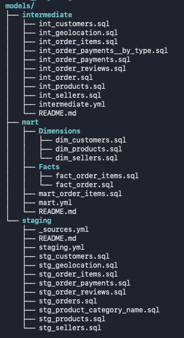

Organized by transformation layer with clear separation of concerns.

### Staging Models
- `stg_orders` - Order transactions with delivery tracking
- `stg_customers` - Customer demographic data
- `stg_order_items` - Order line items
- `stg_order_payments` - Payment transactions
- `stg_order_reviews` - Customer reviews and ratings
- `stg_products` - Product catalog
- `stg_sellers` - Seller information
- `stg_geolocation` - Brazilian geolocation data

### Intermediate Models
- `int_order` - Enriched orders with customer, payment, and review details
- `int_order_items` - Items with product, seller, and order context
- `int_order_reviews` - Deduplicated reviews (one per order)
- `int_order_payments` - Aggregated payment details by order
- `int_customers` - Customer profiles with geolocation
- `int_sellers` - Seller profiles with geolocation
- `int_products` - Product catalog with category translations
- `int_geolocation` - Deduplicated geolocation by zip code

### Marts Models
- `dim_customers` - Customer dimension with lifetime metrics
- `dim_products` - Product dimension with sales performance
- `dim_sellers` - Seller dimension with performance metrics
- `fct_orders` - Order fact table with comprehensive metrics
- `fct_order_items` - Order line item fact table (wide denormalized)

---

## Key Features

### 1. Custom Macros

**Timezone Conversion**

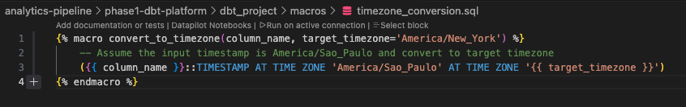

Reusable macro for converting timestamps across timezones:
- Treats source timestamps as São Paulo time (UTC-3)
- Converts to Eastern Time for US-based analysis
- Used across all timestamp columns in staging layer

### 2. Data Quality Framework

**Custom Generic Tests**

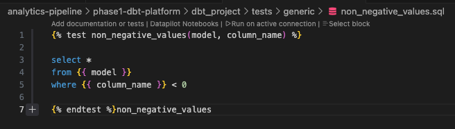

Created reusable generic tests including:
- `positive_values` - Ensures numeric columns > 0
- `non_negative_values` - Ensures numeric columns ≥ 0
- Applied to prices, payments, freight values

**Data Quality Findings:**
- Identified ~5 canceled orders with delivery dates (<1% of canceled orders)
- Implemented tiered testing (WARN vs ERROR severities)
- 30+ tests across all layers

### 3. Comprehensive Documentation

**YAML Schema Documentation**

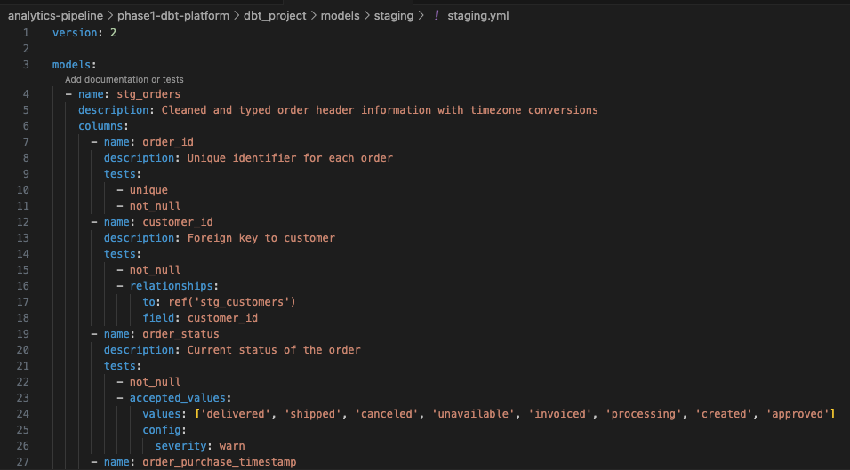

Every model documented with:
- Model-level descriptions
- Column-level descriptions
- Data type specifications
- Relationship mappings
- Test configurations

---

## Build Results

### Staging Layer

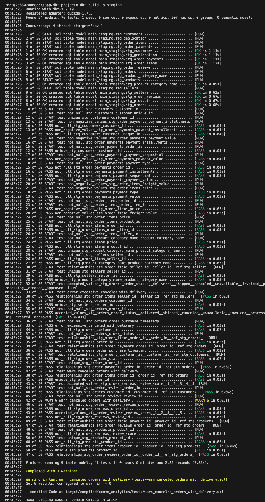

8 models built successfully with data quality tests passing.

### Intermediate Layer

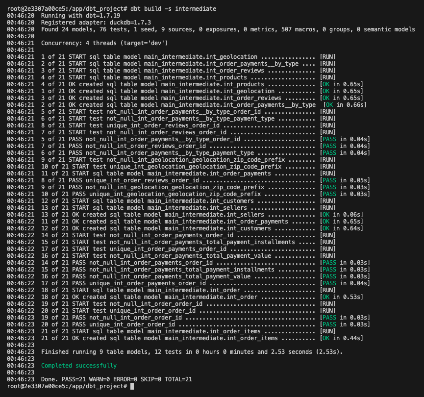

6 models with complex business logic and joins executed successfully.

### Marts Layer

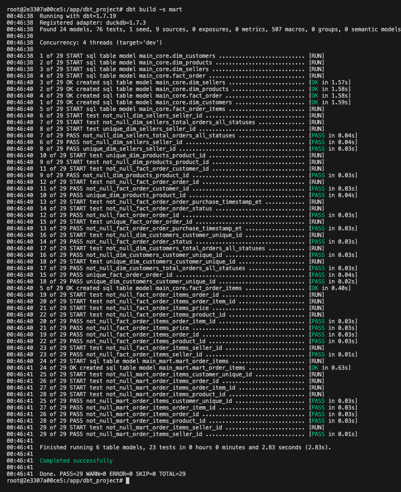

5 dimensional models created and tested, ready for analytics.

---

## Sample Outputs

### Seed Data: Brazilian Holidays

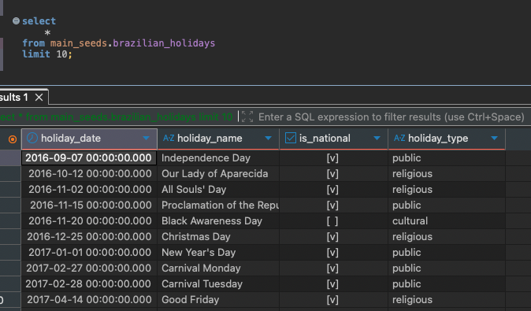

Reference table for time-series analysis:
- 26 holidays across 2016-2018
- Joined to orders for holiday shopping pattern analysis

### Dimension: Customers

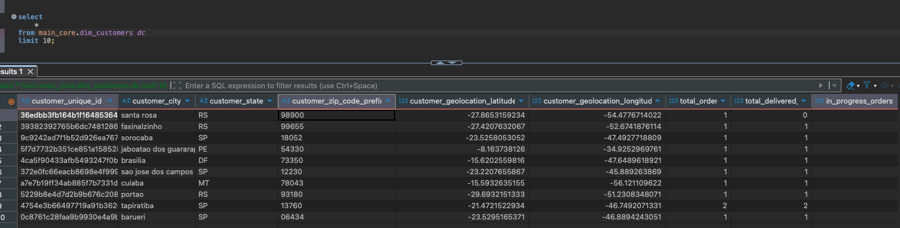

Customer dimension showing:
- Lifetime value metrics
- Order history aggregations
- Behavioral flags (repeat customers, payment preferences)
- Geographic attributes

### Fact: Orders

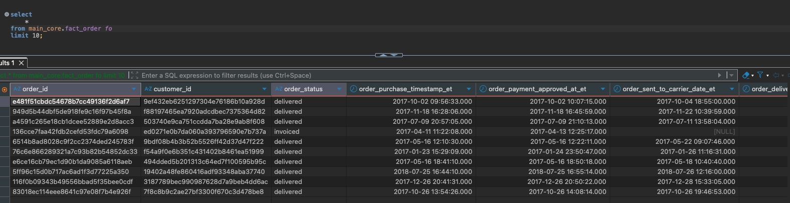

Order fact table including:
- Order totals and item counts
- Delivery performance metrics
- Payment details
- Review sentiment
- Holiday flags

### Fact: Order Items (Wide Table)

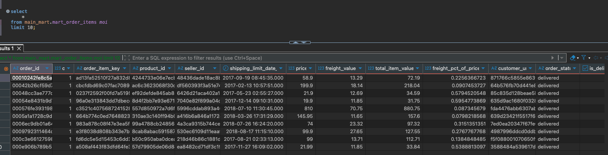

Comprehensive order line item table with:
- Item-level pricing and freight
- Product attributes denormalized
- Order context (status, delivery, reviews)
- Customer and seller details
- Pre-joined for BI tool performance

---

## Data Sources

**Dataset:** Brazilian E-commerce Public Dataset by Olist  
**Source:** Kaggle  
**Records:** 100k+ orders, 32k+ products, 3k+ sellers  
**Time Period:** September 2016 - December 2018

**Raw Tables:**
- Orders (100k rows)
- Order Items (112k rows)
- Order Payments (103k rows)
- Order Reviews (99k rows)
- Customers (99k rows)
- Products (32k rows)
- Sellers (3k rows)
- Geolocation (1M rows)

---

## Additional Features

### Seed Data

**Brazilian Holidays** - Reference table for time-series analysis
- 26 holidays across 2016-2018
- Joined to orders for holiday shopping pattern analysis

### Surrogate Keys

- Generated composite keys using `dbt_utils.generate_surrogate_key`
- Example: `order_item_key` from `order_id` + `order_item_id`

### Data Quality Enhancements

**Imputed Missing Data:**
- Order approval timestamps for delivered orders
- Using purchase timestamp as fallback when approval_at is NULL

**Deduplication Logic:**
- Reviews: Most recent review within 1-day window
- Geolocation: Most common coordinates per zip code

---

## Getting Started

### Prerequisites
```bash
- Docker Desktop
- Git
```

### Setup
```bash
# Clone repository
git clone https://github.com/YOUR_USERNAME/analytics-pipeline.git
cd analytics-pipeline/phase1-dbt-platform

# Start Docker environment
docker compose build
docker compose up -d

# Enter container
docker compose exec dbt bash

# Load data
python /app/scripts/load_data.py

# Run dbt pipeline
dbt seed              # Load Brazilian holidays
dbt run               # Build all models
dbt test              # Run all tests
dbt build             # Run and test all models  
dbt docs generate     # Generate documentation
```

---

## Testing Strategy

**Test Coverage:**
- **Staging:** 25+ tests (uniqueness, not null, relationships, accepted values)
- **Intermediate:** 10+ tests (business logic validation, custom tests)
- **Marts:** 15+ tests (dimensional integrity, metric validation)

**Test Severities:**
- **ERROR:** Critical constraints (PKs, FKs, required fields)
- **WARN:** Data quality monitoring (edge cases, accepted values)

---

## Key Metrics & Insights

**Customer Metrics:**
- Lifetime value (LTV)
- Repeat purchase rate
- Average days between orders
- Review sentiment distribution

**Seller Metrics:**
- Total revenue and order volume
- On-time delivery rate
- Average review scores
- Product catalog diversity

**Product Metrics:**
- Units sold and revenue
- Customer satisfaction
- Average delivery time
- Seller count per product

**Order Metrics:**
- Delivery performance
- Payment method distribution
- Review rates
- Holiday impact analysis

---

## Technical Highlights

### Performance Optimizations
- Materialized tables for marts layer
- Views for staging and intermediate layers
- Surrogate keys for efficient joins
- Denormalized wide tables for BI tools

### Best Practices Demonstrated
- Modular SQL with CTEs
- DRY principles with macros
- Comprehensive testing at every layer
- Clear naming conventions
- Detailed documentation
- Version-controlled transformations

---

## Project Stats

- **Total Models:** 19 (8 staging + 6 intermediate + 5 marts)
- **Total Tests:** 30+
- **Custom Macros:** 2
- **Custom Tests:** 2
- **Seed Files:** 1
- **Lines of SQL:** 1,500+

---

## Author

**[Shreyeshi Somya]** 

**Skills Demonstrated:** dbt, SQL, Data Modeling, Docker, Data Quality, Analytics Engineering