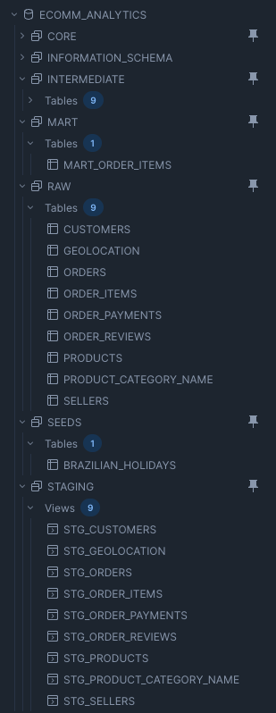
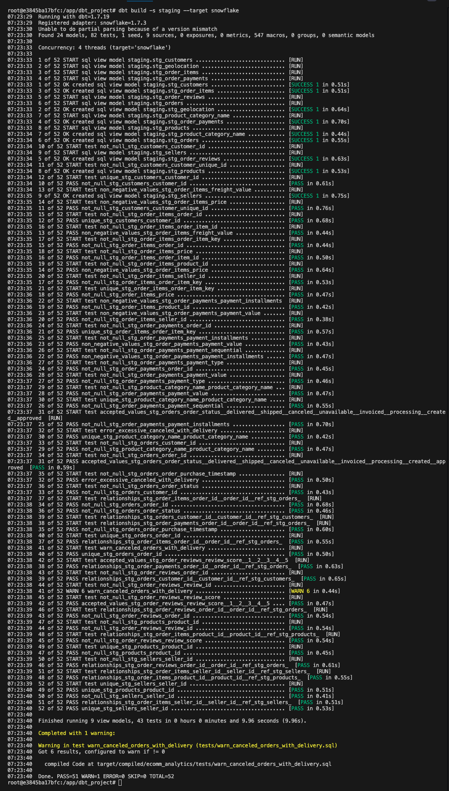
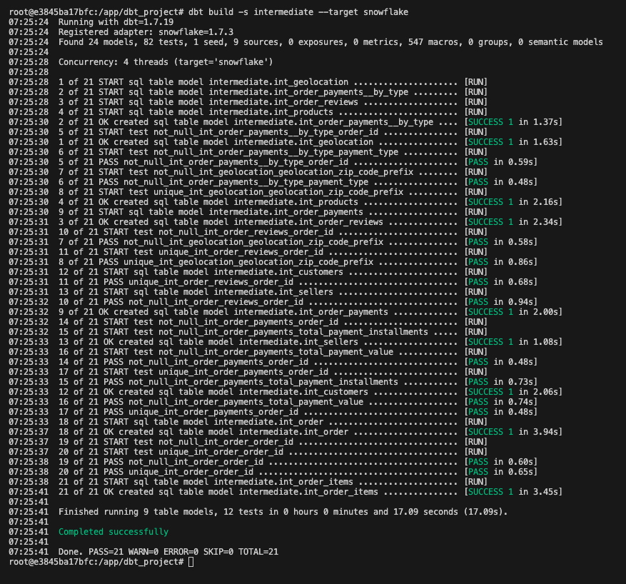
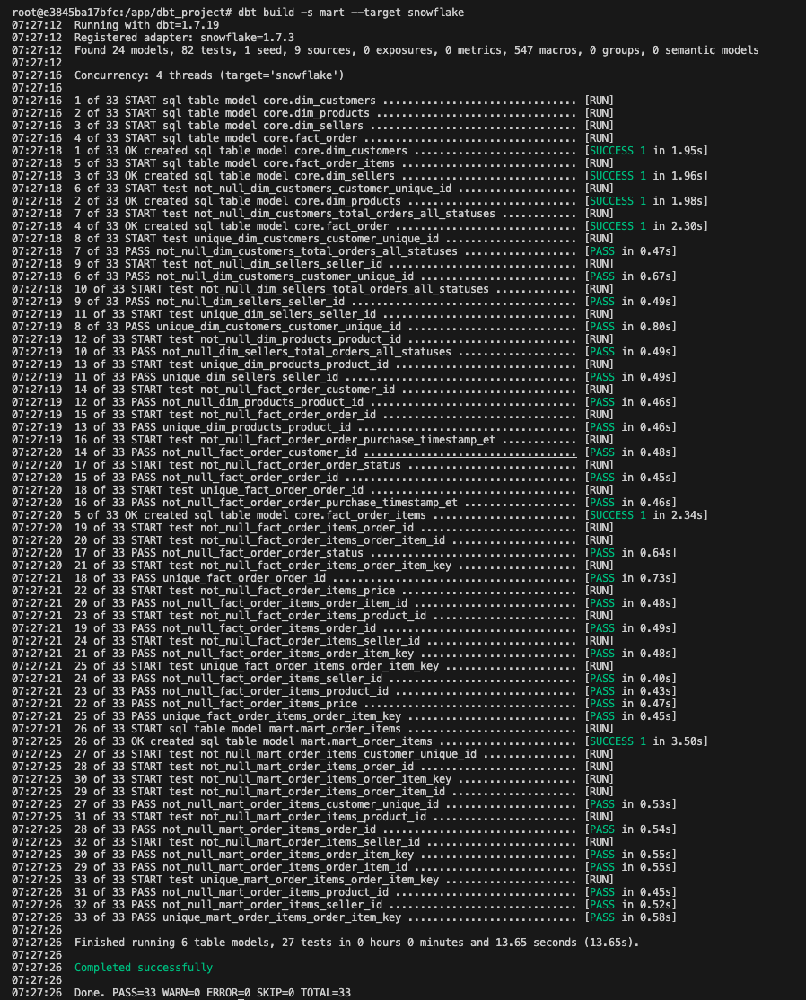
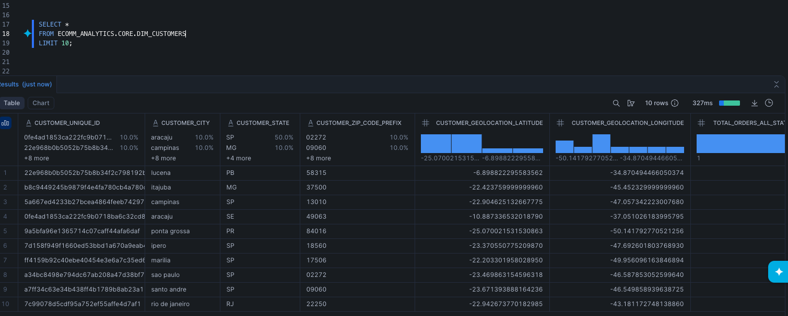
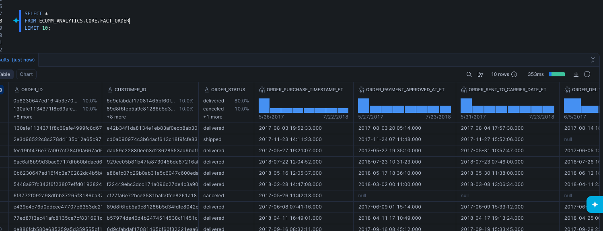
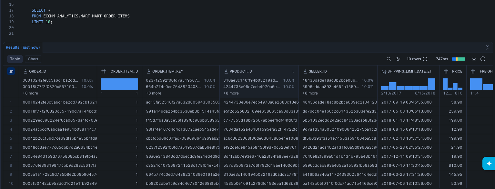

# Phase 1.5: Snowflake Cloud Migration

Migration of the dbt analytics pipeline from local DuckDB to Snowflake cloud data warehouse, demonstrating cloud-scale data engineering capabilities.

---

## Overview

Extended Phase 1 by deploying the entire dbt transformation pipeline to Snowflake. The project now supports dual deployment targets: DuckDB for local development and Snowflake for production deployment.

---

## Objectives Achieved

✅ **Cloud Data Warehouse Deployment** - Migrated 1M+ rows across 9 source tables to Snowflake  
✅ **Dual-Target Architecture** - Single codebase supporting both DuckDB and Snowflake  
✅ **Cross-Database SQL Compatibility** - Database-agnostic macros and functions  
✅ **Production Best Practices** - Proper schema organization and credential management  

---

## Tech Stack

- **Cloud Platform:** Snowflake (AWS US-East-1)
- **Compute:** XSMALL warehouse with auto-suspend
- **Connection:** dbt-snowflake adapter 1.7.3
- **Authentication:** Environment variables

---

## Architecture

### Schema Structure
```
ECOMM_ANALYTICS (Database)
├── RAW (9 tables, 1M+ rows)
├── STAGING (9 models)
├── INTERMEDIATE (9 models)
├── MARTS (6 models)
└── SEEDS (1, brazilian_holidays)
```

### Data Flow
```
Raw CSVs → Snowflake RAW → dbt STAGING → dbt INTERMEDIATE → dbt MARTS → Analytics
```

### Snowflake Tables



Properly organized schemas with clean naming (STAGING, INTERMEDIATE, MARTS).

---

## Setup Process

### 1. Snowflake Configuration
```sql
CREATE WAREHOUSE COMPUTE_WH
  WAREHOUSE_SIZE = 'XSMALL'
  AUTO_SUSPEND = 60
  AUTO_RESUME = TRUE;

CREATE DATABASE ECOMM_ANALYTICS;
CREATE SCHEMA ECOMM_ANALYTICS.RAW;
CREATE SCHEMA ECOMM_ANALYTICS.STAGING;
CREATE SCHEMA ECOMM_ANALYTICS.INTERMEDIATE;
CREATE SCHEMA ECOMM_ANALYTICS.MARTS;
```

### 2. Data Loading

Loaded via Snowflake UI:
- CUSTOMERS: 99,441 rows
- ORDERS: 99,441 rows
- ORDER_ITEMS: 112,650 rows
- ORDER_PAYMENTS: 103,886 rows
- ORDER_REVIEWS: 99,224 rows
- PRODUCTS: 32,951 rows
- SELLERS: 3,095 rows
- GEOLOCATION: 1,000,163 rows
- PRODUCT_CATEGORY_NAME: 71 rows

**Key considerations:**
- Zip codes: VARCHAR (preserve leading zeros)
- Timestamps: TIMESTAMP_NTZ (no timezone)

### 3. dbt Configuration

**Added to Dockerfile:**
```dockerfile
RUN pip install --no-cache-dir \
    dbt-snowflake==1.7.3 \
    snowflake-connector-python
```

**Added to profiles.yml:**
```yaml
snowflake:
  type: snowflake
  account: "{{ env_var('SNOWFLAKE_ACCOUNT') }}"
  user: "{{ env_var('SNOWFLAKE_USER') }}"
  password: "{{ env_var('SNOWFLAKE_PASSWORD') }}"
  role: ACCOUNTADMIN
  database: ECOMM_ANALYTICS
  warehouse: COMPUTE_WH
  schema: RAW
  threads: 4
```

**Added to docker-compose.yml:**
```yaml
environment:
  - SNOWFLAKE_ACCOUNT=your_account.us-east-1
  - SNOWFLAKE_USER=your_username
  - SNOWFLAKE_PASSWORD=your_password
```

---

## SQL Compatibility Updates

### Timezone Conversion Macro

**Updated `macros/timestamp_macros.sql`:**
```sql

    
        CONVERT_TIMEZONE('America/Sao_Paulo', '{{ target_timezone }}', {{ column_name }})
    
        ({{ column_name }}::TIMESTAMP AT TIME ZONE 'America/Sao_Paulo' AT TIME ZONE '{{ target_timezone }}')
    

```

### Other Compatibility Changes

- **Date functions:** Changed `date_diff()` to `datediff()` for Snowflake
- **Boolean aggregation:** Replaced `bool_or()` with `max()` for cross-database compatibility

---

## Deployment Commands
```bash
# Enter container
docker compose exec dbt bash

# Deploy to Snowflake
dbt deps
dbt seed --target snowflake
dbt run --target snowflake
dbt test --target snowflake

# Switch between environments
dbt run                    # DuckDB (default)
dbt run --target snowflake # Snowflake
```

---

## Build Results

### Staging Layer



9 staging models built successfully on Snowflake with all tests passing.

### Intermediate Layer



9 intermediate models with complex business logic deployed to cloud.

### Marts Layer



5 dimensional models (3 dimensions + 2 facts + 1 mart) ready for analytics.

---

## Sample Data

### Dimension: Customers



Customer dimension with lifetime metrics, behavioral flags, and geographic attributes.

### Fact: Orders



Order fact table with comprehensive metrics including delivery performance, payment details, and review sentiment.

### Fact: Order Items



Wide denormalized order line item table with product, seller, and customer context pre-joined for BI performance.

---

## Key Challenges & Solutions

### Challenge 1: Schema Naming
**Issue:** Models created in `RAW_STAGING` instead of `STAGING`  
**Solution:** Added `generate_schema_name` macro to use clean schema names

### Challenge 2: Timezone Functions
**Issue:** DuckDB's `AT TIME ZONE` not supported in Snowflake  
**Solution:** Created database-aware macro with conditional logic

### Challenge 3: Boolean Aggregation
**Issue:** `bool_or()` is DuckDB-specific  
**Solution:** Used `max()` which works in both databases

---

## Storage & Performance

### Storage Breakdown (Compressed)

- Raw data: ~49MB
- Staging: ~53MB
- Intermediate: ~53MB
- Marts: ~63MB
- **Total: ~220MB**

**Note:** Snowflake automatically compresses data (~2.7x compression from 130MB CSV)

### Build Times

| Layer        | DuckDB | Snowflake |
|--------------|--------|-----------|
| Staging      | 3s     | 10s       |
| Intermediate | 3s     | 17s       |
| Marts        | 3s     | 14s       |
| **Total**    | 9s     | 41s       |

---

## Cost Analysis

**Snowflake Free Trial:**
- $400 credits included
- XSMALL warehouse: ~$2/hour (when running)
- Auto-suspend after 60 seconds
- **Estimated project cost: ~$5-10**

---

## Skills Demonstrated

- Snowflake architecture and configuration
- Multi-environment deployment (dev/prod)
- Cross-database SQL compatibility
- Cloud data warehouse best practices
- Environment variable management
- Cost optimization strategies

---

## Resources

- [Snowflake Documentation](https://docs.snowflake.com/)
- [dbt-snowflake Adapter](https://docs.getdbt.com/reference/warehouse-setups/snowflake-setup)
- [Project Repository](https://github.com/shreyeshi-somya/analytics-pipeline)

---

## Author

**Shreyeshi Somya**

---