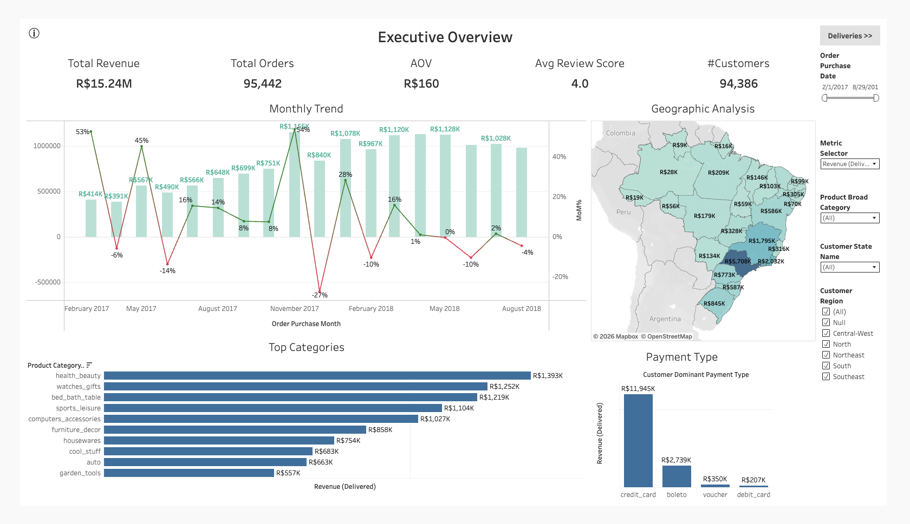
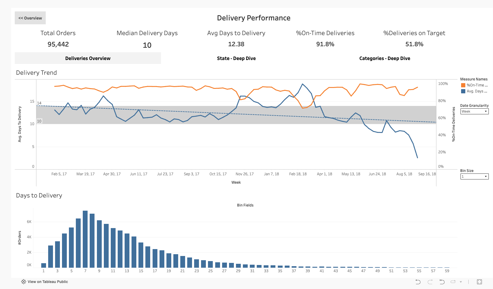
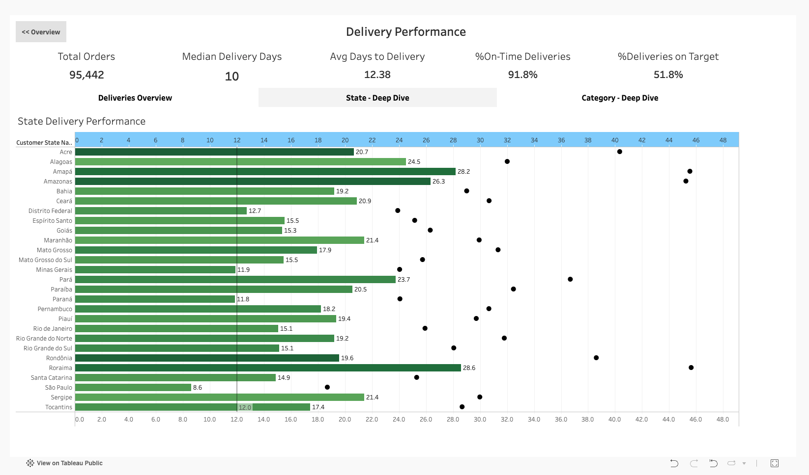
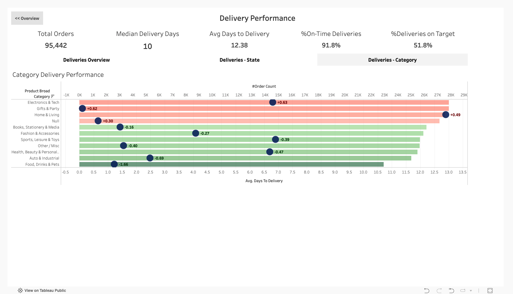

# Phase 2: Tableau Data Visualization

Interactive executive dashboards built with Tableau Public, showcasing advanced visualization techniques and business intelligence best practices for Brazilian e-commerce analytics.
**Published Dashboard:** [Link](https://public.tableau.com/app/profile/shreyeshi.somya/viz/ecomm-analytics/Dashboard1)

---

## 📊 Overview

This phase transforms analytics-ready data from Phase 1 into actionable executive dashboards. The project demonstrates proficiency in:
- Advanced Tableau features (LODs, parameters, dual-axis charts)
- Interactive dashboard design with multi-view navigation
- Data storytelling and business insight delivery
- Professional UI/UX for executive audiences

---

## 🛠️ Tech Stack

- **Visualization:** Tableau Public
- **Data Source:** `mart_order_items` (from Phase 1 dbt pipeline)
- **Data Volume:** 95,442 delivered orders, 94,386 customers
- **Time Period:** February 2017 - August 2018
- **Geographic Scope:** 27 Brazilian states

---

## 📱 Dashboard Structure

**Two Main Dashboards:**

1. **Executive Overview** - High-level business metrics and trends
2. **Delivery Performance** - Operational analytics with three navigable views:
   - Deliveries Overview (default)
   - State - Deep Dive
   - Category - Deep Dive

**Navigation:** Button-based navigation between dashboards and between delivery views

---

## 📈 Dashboard 1: Executive Overview



**Purpose:** High-level business performance monitoring for executive leadership

---

### **Features:**

#### **KPI Cards (5)**
- **Total Revenue:** R$15.24M (delivered orders only)
- **Total Orders:** 95,442
- **Average Order Value (AOV):** R$160
- **Average Review Score:** 4.0/5.0
- **Total Customers:** 94,386

#### **Monthly Trend Analysis**
- **Dual-axis chart:** Revenue bars + MoM% change line
- **Color-coded trends:** Green = growth, Red = decline
- **Insights:** Strong seasonality (Black Friday spikes), volatile MoM performance

#### **Geographic Analysis - Brazil Map**
- **Dynamic coloring:** Updates based on metric selector parameter
- **State-level detail:** Full state names with regional groupings
- **Key Finding:** São Paulo dominates revenue (37%), but northern states show higher AOV

#### **Top 10 Categories**
- **Parameter-driven:** Dynamically ranks by selected metric
- **Top performers:** Health & Beauty (R$1.39M), Watches/Gifts (R$1.25M)

#### **Payment Distribution**
- **Breakdown by type:** Credit Card (78%), Boleto (18%), Others (4%)
- **Insight:** Credit card dominance typical of Brazilian e-commerce

---

### **Interactive Controls:**

**1. Metric Selector Parameter (6 options):**
- Revenue (Delivered)
- Orders (Delivered)
- Number of Customers
- Number of Items sold
- Average Order Value
- Review Score
- **Effect:** Changes 4 charts simultaneously (Trend, Map, Categories, custom formatting)

**2. Filters:**
- **Date Range Slider:** Feb 2017 - Aug 2018
- **State Multi-Select:** Full state names
- **Region Checkboxes:** 5 Brazilian regions (North, Northeast, Central-West, Southeast, South)
- **Product Category Groups:** 10 broad categories (from 71 granular)

**3. Dashboard Actions:**
- Click state on map → filters all charts
- Automatic cross-filtering across visualizations

**4. Navigation:**
- **"Deliveries >>"** button (top-right) → Navigate to Delivery Performance dashboard

---

### **Key Insights:**

**Revenue Patterns:**
- Peak month: November 2017 (R$1.16M) - Black Friday effect
- MoM volatility: +45% peak growth, -27% max decline
- Steady revenue despite customer acquisition challenges

**Geographic Distribution:**
- Southeast region dominates: ~60% of revenue
- **Paradox discovered:** High-population states = lower AOV, Low-population states = higher AOV
- Hypothesis: Urban areas have frequent small purchases, rural areas have infrequent large baskets

**Customer Behavior:**
- Low repeat rate: Only 3% of customers make multiple purchases
- High satisfaction: 4.0/5.0 average despite delivery challenges
- Payment preference: Strong credit card adoption (installment culture)

---

### **Skills Demonstrated:**

✅ **Parameters:** Dynamic metric selection affecting multiple charts  
✅ **Calculated Fields:** Complex string formatting, conditional logic, MoM% calculations  
✅ **Table Calculations:** Month-over-Month % change with LOOKUP()  
✅ **Dual-Axis Charts:** Bars + line with independent scales  
✅ **Dashboard Actions:** Click-to-filter cross-chart interactivity  
✅ **Custom Formatting:** Currency formatting, number abbreviations (K/M), conditional colors  
✅ **Geographic Mapping:** Brazil states with custom regional hierarchies  
✅ **Data Enrichment:** Seed files for state names, regions, category rollups  
✅ **Dashboard Navigation:** Button-based navigation between dashboards  

---

## 🚚 Dashboard 2: Delivery Performance (Operations Deep Dive)

**Purpose:** Operational analytics for delivery optimization and performance monitoring

**Navigation Structure:** 
- **"<< Overview"** button (top-left) → Navigate back to Overview dashboard
- Three button-controlled views within single dashboard

---

### **View 1: Deliveries Overview** (Default)



#### **KPI Cards (5)**
- **Total Orders:** 95,442
- **Median Delivery Days:** 10 (more realistic than avg)
- **Avg Days to Delivery:** 12.38
- **% On-Time Deliveries:** 91.8% (vs estimated delivery date)
- **% Deliveries on Target:** 51.8% (vs 10-day company goal)

#### **Delivery Trend (Dual-Axis with Advanced Features)**
- **Blue line:** Average delivery days over time
- **Orange line:** % On-Time deliveries
- **Reference band:** Gray shaded area (8-14 days acceptable range)
- **Trend line:** Shows delivery time improving overall
- **Parameter:** Date granularity switcher (Week/Month/Quarter)

**Key Insight:** Dramatic improvement in late 2018 (18→8 days), but on-time % dropped (paradox: faster deliveries but worse promise-keeping)

#### **Days to Delivery Histogram**
- **Distribution:** Right-skewed, most orders 6-12 days
- **Parameter:** Dynamic bin size (1, 3, 5, 7, 10 days)
- **Filter:** Limited to 0-60 days (removed extreme outliers)

---

### **View 2: State - Deep Dive**



*Navigate via "State - Deep Dive" button at top of dashboard*

#### **State Delivery Performance (Bullet Chart)**
- **Green bars:** Actual avg delivery days per state
- **Black dots:** State-specific estimated delivery (what was promised)
- **Red dashed line:** Company target (10 days)
- **Color gradient:** Green (beating estimate) → Red (missing estimate)
- **Sorting:** Ordered by avg delivery days (slowest to fastest) for easy identification of problem areas

**Triple Benchmark Comparison:**
1. **Actual vs Estimated:** Most states beat their promises ✅
2. **Actual vs Target:** Most states miss 10-day stretch goal ⚠️
3. **State-to-state variation:** Northern states slower (distance effect)

**Advanced Features:**
- **LOD calculation:** Dynamic target per state (not fixed)
- **Tooltip with indicators:** 🟢 Beating Estimate / 🔴 Missing Estimate
- **Dual-axis:** Bars + dots overlaid
- **Diverging color palette:** Centered on 0 variance
- **Interactive filters:** State multi-select and Region checkboxes for focused analysis
- **Smart sorting:** Descending by delivery days - worst performers at top for immediate visibility

**Performance Spectrum:**
- **Worst Performers (Top):** Roraima (28.6 days), Amapá (28.2 days), Amazonas (26.3 days) - remote northern states
- **Best Performers (Bottom):** São Paulo (8.6 days), Paraná (11.8 days), Minas Gerais (11.9 days) - urban southeast
- **Geographic Pattern:** Clear north-south gradient showing infrastructure/distance impact

---

### **View 3: Category - Deep Dive**



*Navigate via "Category - Deep Dive" button at top of dashboard*

#### **Category Delivery Performance (LOD + Dual Encoding)**
- **Bar length:** Avg delivery days by category
- **Bar color:** Variance from overall avg (Green = faster, Red = slower)
- **Circle size:** Order volume (bigger = more orders)
- **Circle color:** Navy blue (neutral)
- **Labels:** +/- days variance from avg

**Dual Insights:**
1. **Speed:** Food/Drinks fastest (-1.66 days vs avg), Electronics slowest (+0.63)
2. **Volume:** Electronics has HUGE volume despite being slow (operational bottleneck!)
3. **Actionable:** High-volume + slow categories = priority for improvement

**LOD Expression Used:**
```tableau
Variance from Overall Avg = 
  {FIXED [Product Category]: AVG([Days To Delivery])} - 
  {FIXED : AVG([Days To Delivery])}
```

**Top Insights:**
- **Electronics & Tech:** Slowest but highest volume (16K orders) - needs process improvement
- **Food, Drinks & Pets:** Fastest delivery (-1.66 days) - perishable goods priority
- **Home & Living:** Very slow (+0.49 days) with massive volume (26K orders) - bulky items challenge

---

### **Navigation Between Views:**

**Button Implementation:**
- **"<< Overview"** button (top-left) → Returns to Executive Overview dashboard
- **"Deliveries Overview"** button → Shows trend + histogram view
- **"State - Deep Dive"** button → Shows state bullet chart
- **"Category - Deep Dive"** button → Shows category performance chart

**Technical Implementation:**
- Three separate dashboard instances with identical KPI cards
- Navigation buttons link between dashboards
- Maintains consistent layout and styling across views

---

### **Skills Demonstrated:**

✅ **LOD Expressions (FIXED):** Calculate variance from overall average  
✅ **Multi-Dashboard Navigation:** Button-based view switching with consistent layout  
✅ **Dual-Axis Charts:** Multiple measures with different scales  
✅ **Reference Bands:** Shaded acceptable range zones  
✅ **Trend Lines:** Linear regression showing improvement trajectory  
✅ **Parameter-Controlled Bins:** Dynamic histogram bin sizing  
✅ **Bullet Charts:** Actual vs estimated vs target triple comparison  
✅ **Dual Encoding:** Size + color conveying different metrics  
✅ **Diverging Color Palettes:** Red-Green centered on zero  
✅ **Custom Tooltips:** Conditional indicators and formatted text  
✅ **Dynamic Date Granularity:** Week/Month/Quarter parameter switching  
✅ **Dashboard Design:** Consistent branding across multiple linked views  

---

## 🎨 Design Principles

### **Color Palette**
- **Primary:** Teal/Turquoise (#4ECDC4) - main data
- **Secondary:** Navy Blue (#1A535C) - accents, volume indicators
- **Success:** Green (#2ECC71) - positive trends, beating targets
- **Warning:** Red (#E74C3C) - negative trends, missing targets
- **Neutral:** Grays for backgrounds and secondary text

### **Layout Philosophy**
- **F-pattern reading flow:** Critical metrics top-left, details bottom-right
- **Visual hierarchy:** Size and position indicate importance
- **White space:** Clean, uncluttered executive-friendly design
- **Consistent spacing:** 10px padding throughout
- **Navigation clarity:** Prominent buttons with clear labels

### **Interactivity Strategy**
- **Progressive disclosure:** Overview → Deep dive on demand
- **Single-click actions:** Minimal effort for maximum insight
- **Clear navigation:** Prominent buttons between dashboards and views
- **Parameter controls:** Visible, accessible, intuitive
- **Consistent experience:** Same KPIs across all delivery views

---

## 📊 Data Enhancements (from Phase 1)

### **Seed Files Added:**

**1. Brazilian States & Regions** (`brazilian_states.csv`)
- Maps 2-letter codes (SP, RJ) → Full names (São Paulo, Rio de Janeiro)
- Groups into 5 regions (North, Northeast, Central-West, Southeast, South)
- Joined in `stg_geolocation`

**2. Product Category Rollups** (`product_category_rollup.csv`)
- Consolidates 71 granular categories → 10 broad groups:
  - Electronics & Tech
  - Health, Beauty & Personal Care
  - Home & Living
  - Fashion & Accessories
  - Sports, Leisure & Toys
  - Food, Drinks & Pets
  - Auto & Industrial
  - Books, Stationery & Media
  - Gifts & Party
  - Other / Misc
- Joined in `stg_products`

---

## 🔍 Key Business Insights

### **Revenue Performance:**
- **Total:** R$15.24M over 19 months
- **Growth:** Volatile with seasonal peaks (Black Friday, holidays)
- **Average Order:** R$160 (stable despite volume fluctuations)

### **Customer Behavior:**
- **Acquisition:** 94,386 unique customers
- **Retention Challenge:** Only 3% repeat rate (single-transaction dominated)
- **Satisfaction:** 4.0/5.0 despite delivery inconsistencies

### **Geographic Patterns:**
- **Revenue:** Population-correlated (SP, RJ, MG dominate)
- **AOV:** Inverse pattern (rural > urban)
- **Delivery Speed:** Distance-correlated (North slower than Southeast)

### **Delivery Operations:**
- **Speed Improving:** Avg delivery dropped from 14→8 days (2017→2018)
- **Promise-Keeping Challenge:** 91.8% on-time vs estimated, but only 51.8% meet 10-day target
- **Category Bottlenecks:** Electronics (high volume + slow) needs process improvement
- **State Challenges:** Remote northern states 2-3x slower than urban centers

### **Payment Insights:**
- **Credit Card Dominance:** 78% of revenue (Brazilian installment culture)
- **Boleto Usage:** 18% (popular for unbanked/prefer cash equivalent)
- **Low Digital Wallet Adoption:** Minimal voucher/debit usage

---

## 🚀 Advanced Tableau Techniques Used

### **Parameters (3)**
1. **Metric Selector:** Changes 4+ charts simultaneously
2. **Date Granularity:** Week/Month/Quarter switching
3. **Bin Size:** Dynamic histogram binning (1, 3, 5, 7, 10 days)

### **Calculated Fields (15+)**
- MoM% with LOOKUP()
- Dynamic bins with CASE + parameter
- LOD expressions (FIXED at state/category/overall levels)
- Variance calculations
- Conditional formatting logic
- Custom label formatting
- Show/hide logic (attempted)

### **Chart Types (8)**
- Dual-axis line charts
- Bullet charts
- Histograms with dynamic bins
- Horizontal bar charts
- Choropleth maps
- KPI cards (Big Ass Numbers)
- Combination charts (bar + circle dual encoding)
- Reference bands and trend lines

### **Interactive Features**
- Dashboard actions (filter on click)
- Parameter controls (dropdowns, sliders)
- Multi-dashboard navigation (buttons)
- Cross-dashboard navigation
- Hierarchical filters (Region → State)
- Automatic cross-filtering

---

## 📂 Project Structure
```
phase2-tableau-data-vis/
├── dashboards/
│   └── (Workbooks not in repo - see Tableau Public)
├── screenshots/
│   ├── dashboard1/
│   │   └── overview.png
│   └── dashboard2/
│       ├── deliveries-overview.png
│       ├── deliveries-state.png
│       └── deliveries-category.png
├── data/
│   └── mart_order_items.csv (exported from Snowflake)
└── README.md
```

---

## 🔗 Live Dashboards

**📊 Dashboard: [View on Tableau Public](https://public.tableau.com/app/profile/shreyeshi.somya/viz/ecomm-analytics/Dashboard1)**

---

## 💡 Lessons Learned

### **What Worked Well:**
✅ **Parameter-driven design:** Single control affecting multiple charts = elegant UX  
✅ **LOD expressions:** Enabled complex comparisons (actual vs avg) without data prep  
✅ **Dual encoding:** Conveyed two metrics simultaneously (size + color)  
✅ **Seed file integration:** Reference data in dbt = clean, maintainable analytics  
✅ **Multi-dashboard navigation:** Button-based approach simpler and more maintainable than floating containers  
✅ **Consistent KPI layout:** Same metrics across all delivery views reduces cognitive load  

### **Challenges Overcome:**
⚠️ **Tableau Public limitations:** No live Snowflake connection (CSV export required)  
⚠️ **Reference lines on dynamic charts:** Don't work well with parameter-driven date granularity  
⚠️ **Multi-view implementation:** Chose separate dashboards with navigation buttons over complex parameter show/hide logic - cleaner and more maintainable  
⚠️ **Geographic recognition:** Brazil states required explicit country field to avoid US mapping  

### **Design Decisions:**
💡 **Separate dashboards vs tabs:** Chose button navigation between dashboards for cleaner implementation and better performance  
💡 **Fixed vs dynamic targets:** Used LOD to calculate state-specific targets instead of fixed 10-day benchmark  
💡 **Dual encoding:** Prioritized information density over simplicity for analytical deep-dive views  
💡 **Color coding:** Used diverging palettes (green/red) for intuitive performance interpretation  

### **Future Enhancements:**
💡 **Dashboard 3:** Customer & Product Deep Dive (RFM segmentation, cohort analysis)  
💡 **Seller Performance:** Scorecard with weighted metrics (revenue + on-time + reviews)  
💡 **Predictive Analytics:** Forecast delivery times based on category/state/season  
💡 **Treemap visualization:** Payment methods with dual encoding (count + avg installments)  
💡 **Waterfall chart:** Revenue composition (product + freight breakdown)  

---

## 🎓 Skills Portfolio Summary

This project demonstrates mastery of:

**Tableau Expertise:**
- Advanced calculated fields (LODs, table calculations, parameters)
- Interactive dashboard design (actions, filters, multi-dashboard navigation)
- Data storytelling (insight delivery, visual hierarchy)
- Professional formatting (color theory, typography, layout)
- Complex visualizations (bullet charts, dual-axis, dual encoding)

**Business Intelligence:**
- KPI selection and monitoring
- Trend analysis and forecasting
- Segmentation and comparative analysis
- Operational metrics vs strategic goals
- Multi-level analysis (overview → deep dive)

**UX/UI Design:**
- Multi-dashboard navigation architecture
- Consistent branding and layout
- Progressive disclosure patterns
- Executive-friendly presentation

---

## 📚 Resources

**Phase 1 (dbt Pipeline):** [../phase1-dbt-platform/](../phase1-dbt-platform/)  
**Dataset Source:** [Brazilian E-commerce on Kaggle](https://www.kaggle.com/datasets/olistbr/brazilian-ecommerce)  
**Tableau Public Profile:** [Tableau Profile](https://public.tableau.com/app/profile/shreyeshi.somya/vizzes)  

---

## 👤 Author

**Shreyeshi Somya**  

---

*Phase 2 Complete | 2 Dashboards with 4 Interactive Views*  
*Last Updated: February 2026*
