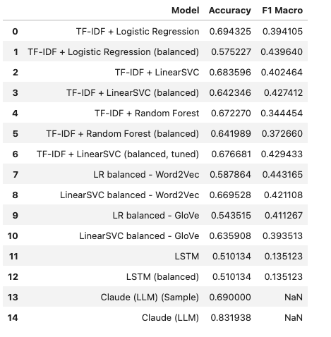
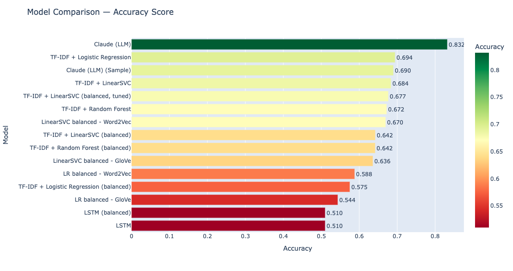
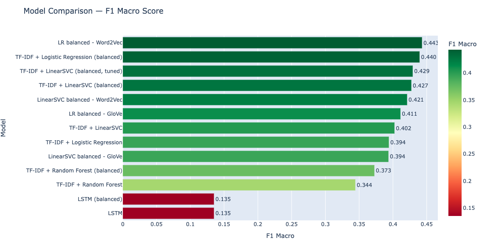

# Phase 4: Applied AI — NLP Sentiment Analysis

## Overview
AI-powered review translation and sentiment analysis on the Olist Brazilian e-commerce dataset. Reviews are originally in Portuguese — we first translate them to English using Claude (Anthropic's LLM), then run multi-model sentiment analysis comparing traditional NLP techniques against LLM-based classification.

This phase builds on the clean data models from Phase 1 (dbt) and the shared DuckDB database used across all phases.

## Dataset
- **98,410** unique reviews from the Olist e-commerce platform
- **40,668** reviews with comment messages, **11,519** with titles
- Review scores: 1–5 stars (heavily skewed — 58% are 5-star)
- All review text originally in Portuguese

## Infrastructure

Runs as the `llm-app` service in the root `docker-compose.yml`. Shares a DuckDB database (`data/analytics.duckdb`) with the dbt and data science services. Requires an Anthropic API key set in `.env`.

## Folder Structure
```
phase4-llm/
├── Dockerfile
├── requirements.txt
├── .env                          # ANTHROPIC_API_KEY (not committed)
├── app/
│   ├── 01_batch_translate_reviews.ipynb   # Translation pipeline
│   ├── 02_submit_batch.ipynb              # Batch API submission
│   ├── 03_retrieve_batch.ipynb            # Batch API retrieval
│   ├── 04_combine_translations.ipynb      # Merge all translations
│   ├── 05_sentiment_analysis.ipynb        # Multi-model sentiment analysis
│   ├── 06_batch_sentiment.ipynb           # LLM sentiment batch submission
│   ├── 07_retrieve_sentiment_batch.ipynb  # LLM sentiment batch retrieval
│   ├── short_review_lookup.csv            # Portuguese→English dictionary for short reviews
│   └── download_models.py                 # GloVe + NLTK data downloader
├── screenshots/
│   ├── model_performance.png              # Full results table
│   ├── accuracy_chart.png                 # Accuracy comparison bar chart
│   └── f1_score_chart.png                 # F1 Macro comparison bar chart
└── README.md
```

## Notebooks

### Part 1: Translation (Notebooks 01–04)

Portuguese → English translation of ~40K review messages and ~11K review titles using a two-tier approach.

#### 01 — Batch Translate Reviews (`01_batch_translate_reviews.ipynb`)

Develops and tests the translation pipeline using Claude Haiku.

**Approach:**
- **Short reviews (<10 chars):** Dictionary lookup using `short_review_lookup.csv` — a curated Portuguese→English mapping for common 1–2 word reviews like "bom" → "good", "otimo" → "great". Text is normalized (accent removal, lowercasing) before lookup. Mapped **2,507** of 2,954 short reviews
- **Longer reviews (≥10 chars):** Translated via Claude Haiku API in batches of 100, using multithreaded parallel execution (5 workers)
- **Stratified sample:** To avoid blocking development on a 3+ hour full translation job, a stratified sample of **5,000 reviews** (1,000 per score) is translated synchronously (~10 minutes) for immediate use
- Both review messages and titles are translated separately

#### 02 — Submit Batch (`02_submit_batch.ipynb`)

Submits the full **49,651 requests** (38,334 messages + 11,317 titles) to Anthropic's Batch API for asynchronous processing at 50% cost.

- Each review is submitted as an individual request with a `custom_id` prefix (`msg_` or `title_`) to distinguish message vs title translations
- Uses Claude Haiku (`claude-haiku-4-5-20251001`) with 512 max tokens for messages, 256 for titles
- Batch ID saved to file for retrieval

#### 03 — Retrieve Batch (`03_retrieve_batch.ipynb`)

Retrieves completed batch results and saves translations.

- **48,825** of 49,651 requests succeeded (18 errored)
- Results pivoted into separate `translated_message` and `translated_title` columns
- **39,946** reviews with translations saved to `llm_outputs.translated_reviews` in DuckDB

#### 04 — Combine Translations (`04_combine_translations.ipynb`)

Merges all translation sources into a single enriched dataset.

- Combines dictionary-based short review translations with Batch API translations
- Prioritizes lookup translations (already validated) over API translations using `combine_first`
- Final dataset: **98,410** reviews with **40,209** translated messages and **11,174** translated titles
- Saved to `llm_outputs.review_translations_final` in DuckDB

---

### Part 2: Sentiment Analysis (Notebooks 05–07)

Multi-model sentiment analysis comparing VADER, TF-IDF classifiers, Word2Vec, GloVe, LSTM, and Claude LLM across **41,940** reviews.

#### 05 — Sentiment Analysis (`05_sentiment_analysis.ipynb`)

Core analysis notebook. Loads translated reviews from `llm_outputs.review_translations_final` and evaluates six modeling approaches across three paradigms — lexicon-based, classical ML, and LLM-based.

**Text Pre-processing:**
- Filtered to reviews with at least one translated field (message or title)
- Combined translated title + message into a single text field
- Lowercased, removed stopwords (preserving negation words like "not", "never"), lemmatized
- Separate `vader_text` (with punctuation/caps) and `clean_text` (fully cleaned) fields

**Models evaluated (5-class: scores 1–5):**

| Model | Accuracy | F1 Macro | Notes |
|-------|----------|----------|-------|
| TF-IDF + Logistic Regression | 69.43% | 0.3941 | High accuracy but ignores minority classes |
| TF-IDF + Logistic Regression (balanced) | 57.52% | 0.4396 | Better minority class recall |
| TF-IDF + LinearSVC | 68.36% | 0.4025 | Slightly better F1 than LogReg |
| TF-IDF + LinearSVC (balanced) | 64.23% | 0.4274 | Improved minority class performance |
| **TF-IDF + LinearSVC (balanced, tuned)** | **67.67%** | **0.4294** | Best traditional ML — tuned with GridSearchCV |
| TF-IDF + Random Forest | 67.23% | 0.3445 | Struggles with sparse TF-IDF features |
| TF-IDF + Random Forest (balanced) | 64.20% | 0.3727 | Overcompensates for class weights |
| LR balanced - Word2Vec | 58.79% | 0.4432 | Highest F1 macro among all 5-class models |
| LinearSVC balanced - Word2Vec | 66.95% | 0.4211 | Averaging word vectors loses context |
| LR balanced - GloVe | 54.35% | 0.4113 | Domain mismatch hurts performance |
| LinearSVC balanced - GloVe | 63.59% | 0.3935 | Wikipedia/news embeddings underperform |
| LSTM | 51.01% | 0.1351 | Predicts majority class only |
| LSTM (balanced) | 51.01% | 0.1351 | Collapses to single class |

**Models evaluated (3-class: positive/negative/neutral):**

| Model | Accuracy | Notes |
|-------|----------|-------|
| Claude (LLM) (Sample) | 69.00% | 500-review stratified sample (100 per score) |
| **Claude (LLM)** | **83.19%** | **Full dataset — 41,818 reviews (excl. 122 unknowns)** |

**Key findings:**

- **VADER** captures general sentiment trends but struggles with factual complaints ("The product has not arrived yet" tagged as neutral). 36-37% neutral rate on 1-2 star reviews
- **TF-IDF + LinearSVC (balanced, tuned)** is the best traditional ML approach. Tuned with `f1_macro` scoring and `MaxAbsScaler` to preserve TF-IDF sparsity. The C=0.01 regularization improves generalization across all classes
- **Word2Vec** trained on our corpus slightly underperforms TF-IDF on accuracy — averaging word vectors collapses word order and negation context. However, LR balanced Word2Vec achieves the highest F1 macro (0.4432) among all 5-class models
- **GloVe** (pretrained on Wikipedia/news) performs worse than domain-trained Word2Vec due to domain mismatch. "Delivery" in Wikipedia associates with supply chains; in our corpus it associates with "fast", "late", "arrived"
- **LSTM** fails completely — reviews are too short (~10-15 words), severe class imbalance, and linguistically indistinguishable middle classes
- **Claude (LLM)** achieves **83.2% accuracy** on 41,818 reviews with only 0.29% unknown responses — the strongest result by a significant margin. 94% of 1-star reviews correctly labeled negative, 93% of 5-star reviews correctly labeled positive

#### 06 — Batch Sentiment (`06_batch_sentiment.ipynb`)

Submits all **41,940** reviews to Anthropic's Batch API for sentiment classification.

- Each review classified as positive, negative, or neutral using Claude Haiku
- `max_tokens=10` since only a single word response is needed
- Batch ID saved to file for retrieval

#### 07 — Retrieve Sentiment Batch (`07_retrieve_sentiment_batch.ipynb`)

Retrieves completed batch sentiment results and saves to DuckDB.

- All **41,940** requests succeeded (0 errors)
- Results parsed and joined back to review IDs via batch index mapping
- Sentiment distribution: **25,468** positive, **13,520** negative, **2,830** neutral, 122 unknown (0.29%)
- Saved to `llm_outputs.review_sentiments` in DuckDB

---

## Results







### Conclusions

- **Classical ML (TF-IDF)** is the strongest traditional approach. Unbalanced models achieve high accuracy by predicting the majority class, but balanced models with F1 macro scoring are more appropriate for real-world use
- **Word embeddings** (Word2Vec, GloVe) underperform TF-IDF on accuracy. Averaging word vectors loses word order and context. Domain-trained Word2Vec outperforms pretrained GloVe — pretrained embeddings don't always transfer well across domains
- **LSTM** fails entirely, defaulting to majority class prediction. Short reviews, severe class imbalance, and indistinguishable middle classes make this dataset unsuitable for sequential models
- **Claude (LLM)** achieves 83.2% accuracy — a 14 percentage point improvement over the best classical model. LLMs understand context, negation, and nuance that word-frequency models fundamentally cannot capture on small, domain-specific, multilingual datasets

---

## Pipeline Integration

LLM outputs are written directly to the shared DuckDB database (`llm_outputs` schema):
- **`llm_outputs.translated_reviews`** — Batch API translations (39,946 reviews)
- **`llm_outputs.review_translations_final`** — Combined translations from all sources (98,410 reviews)
- **`llm_outputs.review_sentiments`** — Claude sentiment classifications (41,940 reviews)

## Tech Stack
Python, Anthropic Claude API (Haiku), DuckDB, Pandas, NumPy, Scikit-learn, NLTK, VADER, TensorFlow/Keras (LSTM), Gensim (Word2Vec), GloVe, Plotly, Docker, Jupyter
